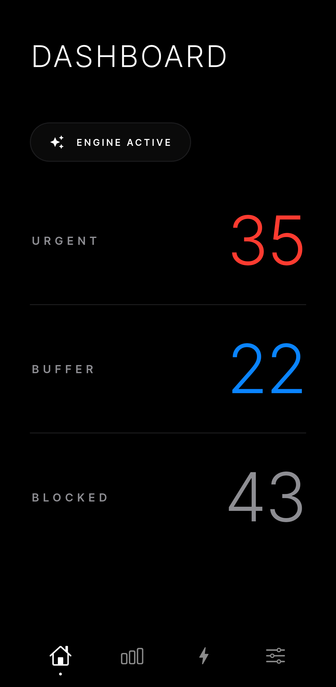
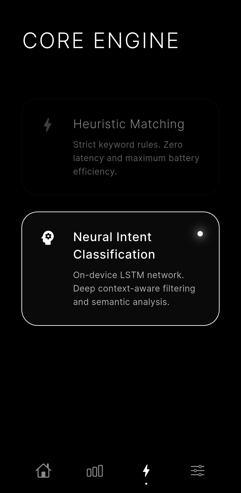
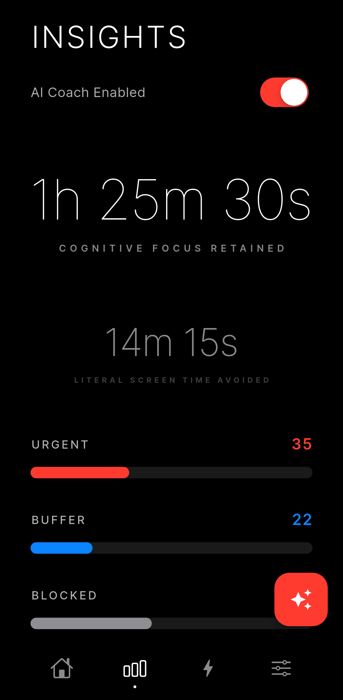
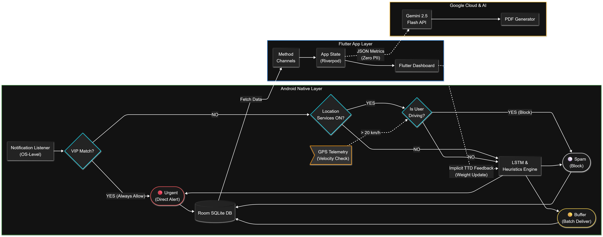

<div align="center">
  <h1>Intent — Attention Firewall</h1>
  <p><em>Your phone intercepts you 80+ times a day. Intent intercepts it first.</em></p>
</div>

**Intent** is a privacy-first, on-device AI notification firewall for Android. Built for the Google Solution Challenge 2026, Intent uses a hybrid LSTM + heuristics engine running entirely offline to triage every notification in real-time — protecting your focus without ever sending your data to the cloud.

<div align="center">
  
  
  
</div>
<br>
<div align="center">
  
  
  
</div>
<br>

<div align="center">
  <a href="LICENSE"></a>
  <a href="https://android.com"></a>
  <a href="https://flutter.dev"></a>
  <a href="https://www.tensorflow.org/lite"></a>
  <a href="https://sdgs.un.org"></a>
</div>

---

## The Problem

Modern smartphones deliver notifications asynchronously with zero awareness of your cognitive state. Existing solutions force a binary choice — block everything or block nothing. Do Not Disturb modes create anxiety about missing genuine emergencies. No solution today understands the *context* of individual messages in real-time, on-device, without compromising privacy.

---

## The Solution

Intent acts as a real-time cognitive firewall at the OS level. Every incoming notification passes through a three-stage decision pipeline before it ever reaches you:

<div align="center">
  
  <br><br>
  
</div>

---

## Key Features

| Feature | Description |
|---|---|
| **Hybrid AI Engine** | On-device LSTM (TFLite) + O(1) heuristic fast-path classifies every notification in milliseconds, fully offline |
| **VIP Contact Bypass** | Named contacts always bypass AI and reach you instantly — Mom's emergency always gets through |
| **GPS Driving Lockdown** | Detects speed >20 km/h via GPS sensor and auto-locks all non-VIP notifications — safety without isolation |
| **Adaptive Learning** | Implicit Time-to-Dismiss (TTD) feedback silently personalizes filtering over time via Context-aware EMA |
| **OLED Dashboard** | Tracks Focus Time Saved, interruption volume, and top distracting apps — all stored locally |
| **AI Cognitive Coach** | Optional: sends only anonymized aggregate stats to Gemini Flash to generate a PDF wellness report |

---

### 🔒 Privacy Guarantee: AI Cognitive Coach

The **AI Insight Generation (PDF Report)** inside the Analytics tab is **100% Opt-In**, fully respecting Intent's core pitch of **Zero Cloud Dependency**. 

* **If you opt out:** Nothing changes. Intent functions strictly on-device indefinitely.
* **If you opt in:** Only thoroughly anonymized metadata (your mathematical counts for *Urgent*, *Buffer*, and *Spam* volumes) alongside the timeframe is sent to the AI.
* **The Absolute Rule:** No raw notification text, no sender details, and no private data are *ever* requested, accessed, or transmitted.  

---

## Architecture

<div align="center">
  
</div>

---

## Technology Stack

| Layer | Technology |
|---|---|
| **Frontend** | Flutter / Dart, fl_chart, pdf package |
| **Android Native** | Kotlin / Java, Android SDK, NotificationListenerService |
| **Local Storage** | Android Room Database (SQLite) |
| **On-Device ML** | TensorFlow Lite — LSTM sequence model for NLP |
| **State Management** | Riverpod |
| **Cloud AI (Optional)** | Google Gemini 2.5 Flash API |

---

## Iterative Field Testing & Performance

The MVP was subjected to continuous, iterative field testing on physical hardware over a rigorous four-week sprint to profile battery consumption, optimize LSTM latency, and fine-tune heuristic edge cases under real-world conditions.

### Hard Data & Optimization Results

Because Intent was built on live telemetry rather than emulation, it achieves remarkable on-device efficiency:

* **The Battery Profiling:** Deep OS-level testing allowed the background Kotlin engine and Room SQLite batching to be optimized to drain **less than 1 mAh** over a full 24-hour cycle (a 0.79% overall battery consumption ratio).
* **The Efficacy Rate:** Live daily logs proved a **~69% reduction** in non-essential interruptions, successfully buffering or silently blocking 84 out of 122 test notifications while achieving 100% delivery for detected urgencies.
* **The GPS Edge Cases:** Conducted live vehicular telemetry testing to ensure the **> 20 km/h** driving lock engaged purely via precise GPS polling—reliably blocking all non-essential pings without ever stalling VIP emergency bypasses.
* **The TFLite Inference:** Local execution latency was driven down to an average of **145ms**, allowing the engine to intercept and destroy payload strings well before the Android UI even attempts to wake the OLED screen.

---

## SDG Alignment

| Goal | How Intent Contributes |
|---|---|
| **SDG 3 — Good Health & Well-being** | Reduces digital anxiety, cognitive fatigue, and stress caused by notification overload |
| **SDG 8 — Decent Work & Economic Growth** | Protects deep work time, enhances productivity, and promotes sustainable digital work habits |

---

## Project Structure

```text
intent-attention-firewall/
├── android/
│   └── app/src/main/
│       ├── java/com/intent/intent_app/
│       │   ├── IntentBrain.java          ← Core ML + heuristics engine
│       │   ├── IntentNotificationService.java ← OS-level interceptor
│       │   ├── DriveSafetyEngine.java    ← GPS Velocity lock manager
│       │   └── db/                       ← Room SQLite local storage
│       └── assets/
│           ├── vocab.json               ← Tokenizer dictionary
│           └── lstm.tflite              ← Trained LSTM model
├── lib/
│   ├── core/                            ← Theme, Services, State
│   ├── data/                            ← Models, Repositories
│   ├── features/                        ← Feature-based folders
│   │   ├── analytics/                   ← AI Coach & Time Focus
│   │   ├── engine/                      ← Main Engine UI
│   │   ├── home/                        ← Timeline Dashboard
│   │   ├── notifications/               ← Intercept logic interfaces
│   │   ├── onboarding/                  ← Initial setup
│   │   └── settings/                    ← Rules, VIPs & Preferences
│   └── main.dart                        ← App Entrypoint
├── assets/
│   └── docs/                            ← High-res system diagrams
├── .env                                 ← Hidden environment variables
└── README.md
```

---

## Getting Started

### Prerequisites

- Flutter SDK 3.0+
- Android Studio / VS Code
- Android device or emulator running Android 8.0+ (API 26+)
- Java 11+

### Installation

```bash
# Clone the repository
git clone https://github.com/Shriram-2005/intent-attention-firewall.git

# Navigate to project
cd intent-attention-firewall

# Install dependencies
flutter pub get

# Run the app
flutter run
```

### Required Permissions

Intent requires the following Android permissions:

| Permission | Reason |
|---|---|
| `BIND_NOTIFICATION_LISTENER_SERVICE` | Core feature — intercept notifications at OS level |
| `ACCESS_FINE_LOCATION` | GPS velocity detection for driving mode |
| `FOREGROUND_SERVICE` | Keep the engine running in background |
| `READ_CONTACTS` | VIP contact matching |

> **Privacy note:** All permissions are used exclusively on-device. No data is transmitted to any server without explicit user consent.

---

## Download

| Link | Description |
|---|---|
| [Latest APK Release](https://bit.ly/intent-apk) | Download APK for sideloading |

---

## Roadmap

| Phase | Feature |
|---|---|
| **v1.1** | Focus streak, end-of-day notification, achievement badges |
| **Phase 2** | Cross-app social trust graph, Wear OS biometric integration |
| **Phase 3** | Migrate LSTM → quantized MobileBERT / DistilBERT via TFLite |
| **Phase 4** | i18n — Tamil, Hindi, Arabic language support |

---

## About the Name

The name **Intent** has two origins that perfectly converge.

In Android development, an `Intent` is the core OS mechanism for inter-app communication — the very channel that notifications travel through. Intent intercepts Intents.

In human terms, Intent means *deliberate, purposeful action* — using your phone with intention rather than being passively interrupted by it.

The name was born in a 5th semester Mobile Application Development course, when the concept of explicit and implicit Intents sparked the idea that the notification pipeline itself could be intercepted and made intelligent.

---

## Built By

**Shri Ram A U**
Solo developer — Intent Labs
Google Solution Challenge 2026

---

## License

This project is fully open source.

---

## Acknowledgements

- Google Solution Challenge 2026
- TensorFlow Lite team for on-device ML tooling
- Flutter and Android open source communities
- Every person who loses focus to their phone — this was built for you

---

<div align="center">
  <em>Built with intention. Protecting yours.</em>
</div>

