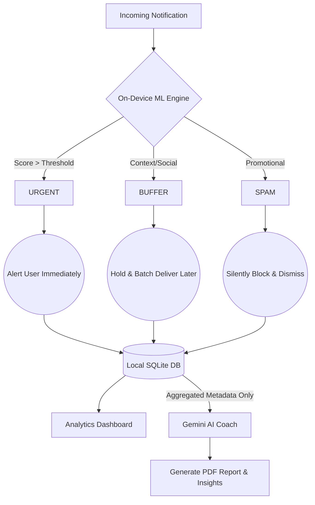

# Google Solutions Challenge - Presentation Outline

## Slide 1: Introduction
**Team Name:** 
Intent

**Team Leader Name:** 
Shri Ram A U

**Vision / Hook:**
*Reclaiming human attention in an age of digital noise through on-device intelligence.*

**Targeted UN Sustainable Development Goals (SDGs):**
*   **Goal 3 (Good Health and Well-being):** Reduces digital anxiety, stress, and cognitive fatigue.
*   **Goal 8 (Decent Work and Economic Growth):** Enhances deep work, productivity, and sustainable work habits.

**The Problem:**
*   **Fractured Attention:** Information overload causes severe stress and cognitive fatigue.
*   **Flawed Solutions:** "Do Not Disturb" modes use an all-or-nothing approach.
*   **The Result:** Users either suffer constant interruptions or anxiety over missing emergencies.

---

## Slide 2: The Solution
**Intent** is an on-device AI-powered, privacy-first notification interceptor with optional cloud insights. 

*   **Smart Triage:** Uses on-device ML to categorize incoming alerts in real-time.
*   **Three Safety Nets:** 
    *   🔴 **Urgent:** Allowed immediately.
    *   🟡 **Buffer:** Held for mindful batching.
    *   ⚪ **Spam:** Silently blocked.
*   **Attention Recovery:** Tracks your "Focus Time Saved" by evaluating deflected distractions.

---

## Slide 3: Why It Wins (USP & Impact)
**The "Intent" Difference:**
Unlike OS focus modes that blanket-block apps, Intent understands the *context* of individual messages (e.g., Mom's emergency vs. Mom's meme).

**Real User Impact (Metrics):**
*   📉 **Up to 70% reduction** in non-essential interruptions.
*   🔋 **Ultra-Low Impact:** <1% battery usage (<1 to 3 mAh background drain).
*   🔒 **Fully Offline Filtering:** Total privacy, raw data never leaves the phone.

---

## Slide 4: Key Features
*   **IntentBrain Engine:** Combines on-device TFLite ML with fast-path heuristics to screen alerts silently in the background.
*   **Smart Triage System:** Sorts notifications into Urgent (allowed), Buffer (batched), and Spam (blocked) in real-time.
*   **Adaptive Learning:** Personalizes filtering behavior over time using on-device feedback loops.
*   **OLED Analytics Dashboard:** Deep-black, glassmorphic UI visualizing daily volume, top interruptions, and "Focus Time Saved" trends.
*   **AI Cognitive Coach:** Generates on-demand, executive-style PDF wellness reports utilizing Google Gemini on anonymized metadata.
*   **100% Offline-First Privacy:** All raw personal data stays strictly on the local Android Room Database.
*   **Context-Aware Adjustments:** Dynamic thresholds auto-adjust for driving, deep work, or nighttime rules.

---

## Slide 5: Process Diagram / Use Case Diagram

### How to make it for your PPT:
*You can copy the code below and paste it into **[Mermaid Live Editor](https://mermaid.live/)** to generate an image to paste into your slide. Alternatively, you can recreate this workflow in Draw.io or Canva.*

---

## Slide 6: Wireframes or Mock Diagram of the Proposed Solution (Optional)
**Instructions for the PPT slide:**
1. Place a screenshot of your main "Toggle / Service Active" screen in the center.
2. Place a screenshot of the **Analytics Dashboard** (showing the Fl_Charts, Top Interruptions Pie Chart, and Focus Time Saved Line Chart) on the left.
3. Place a screenshot of the **PDF Report output** (showing the AI Coach layout and executive summary) on the right.
*Tip: Put them inside a generic phone mockup frame (you can find these in Canva or Figma) for a professional look.*

---

## Slide 7: Architecture Diagram of the Proposed Solution

### How to make it for your PPT:
*Again, paste this syntax into Mermaid Live Editor or recreate it in Draw.io.*

---

## Slide 8: Technologies To Be Used
*   **Frontend:** Flutter, Dart, `fl_chart` (Data Visualization), `pdf` (Report Generation).
*   **Backend / Native:** Kotlin/Java, Android SDK (NotificationListenerService).
*   **Local Storage:** Android Room Database (SQLite).
*   **Machine Learning (On-Device):** TensorFlow Lite (for local text classification/NLP).
*   **Generative AI (Cloud):** Google Gemini 2.5 Flash API (analyzing aggregated safe telemetry for user coach insights).

---

## Slide 9: Estimated Implementation Cost
**Near-zero operational cost by design** — on-device LSTM and heuristic engine eliminates server dependency. Optional Gemini AI Coach operates on anonymized aggregates only, staying well within free tier limits.

---

## Slide 10: Snapshots of the MVP
*Instructions: Add 3-4 high-quality screenshots highlighting:*
1.  **The Analytics Screen** (Showcasing the Focus Time Saved and Contextual States).
2.  **The Interceptor Working** (A blocked notification log).
3.  **The Executive PDF Report** (The Gemini-powered summary).

---

## Slide 11: Links
**GitHub Public Repository:** 
[Link to your GitHub repo]

**Demo Video Link:** 
[Link to YouTube/Drive video]

**MVP / Working Prototype Link:** 
[Link to APK release on GitHub or Google Drive]

---

## Appendix: Napkin.ai Infographic Generation Prompts
*(Copy and paste these exact text blocks into Napkin.ai to generate high-quality infographics for your slides)*

### 1. The Core Solution Flow (For Slide 2 or Slide 5)
**Text to paste into Napkin:**
Generate a flowchart for the Intent App:
An "Incoming Notification" triggers the system.
This notification flows into the "On-Device ML Engine" for context analysis.
The ML Engine then routes the notification into one of three paths:
Path 1 flows to "Urgent", which leads to "Alert the user immediately".
Path 2 flows to "Buffer", which leads to "Hold and batch for later delivery".
Path 3 flows to "Spam", which leads to "Silently block and dismiss".

### 2. Key Features Data Flow (For Slide 4)
**Text to paste into Napkin:**
Generate a process diagram showing how features connect in the Intent app:
"100% On-Device Machine Learning" ensures total privacy because raw data never leaves the phone.
This local ML powers "Smart Categorization", which performs context-aware screening.
The categorization results feed into the "OLED Dashboard", which displays visual analytics tracking the user's Focus Time Saved.
Finally, the Dashboard data connects to the "AI Cognitive Coach", which generates Executive PDF wellness reports via Gemini.

### 3. Technical Architecture Flow (For Slide 7)
**Text to paste into Napkin:**
Generate an architecture flow diagram for the Intent app:
The "Android Native Layer" (Notification Listener Service and TFLite ML model) processes incoming data locally.
This Native Layer saves categorized results to the "Local SQLite Room Database".
The Local Database flows upward via Method Channels to the "Frontend Layer" (Flutter UI and Data Visualization Charts).
The Frontend Layer then passes safely aggregated metadata out to the "Cloud AI Layer" (Google Gemini API).
Finally, the Cloud AI Layer returns formatted insights back to generate "AI PDF Reports".

### 4. Problem vs. Solution Flow (For Slide 1 or 3)
**Text to paste into Napkin:**
Generate a contrasting workflow diagram showing two different paths for handling distractions.
Path ONE (Traditional Focus Modes): "Incoming Notification" flows to an "All-Or-Nothing Blocker". This leads to blanket blocking of everything, which ultimately results in "Anxiety about missed emergencies".
Path TWO (Intent App Solution): "Incoming Notification" flows to "Context-Aware AI Screening". This leads to filtering at the individual notification level. This protects deep work while allowing truly urgent messages through, ultimately resulting in "Peace of mind and high Focus Time Saved".
